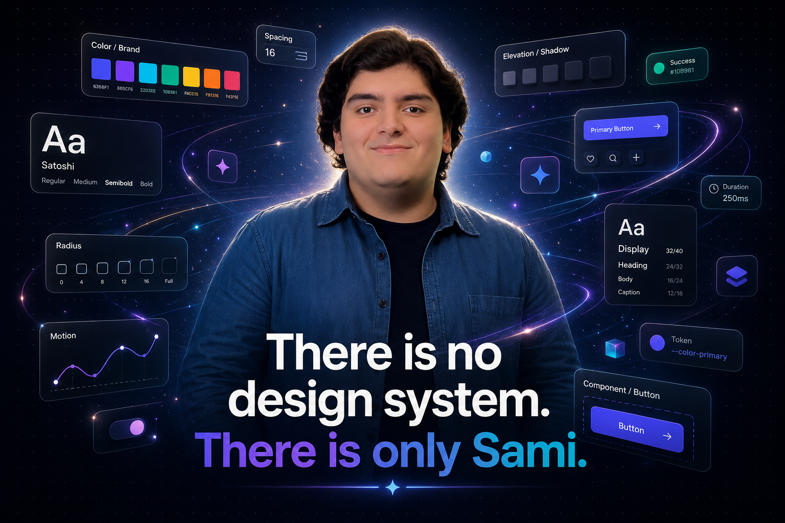
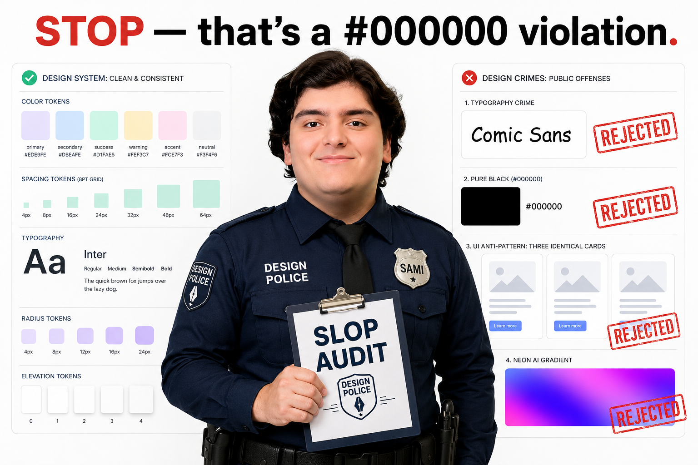
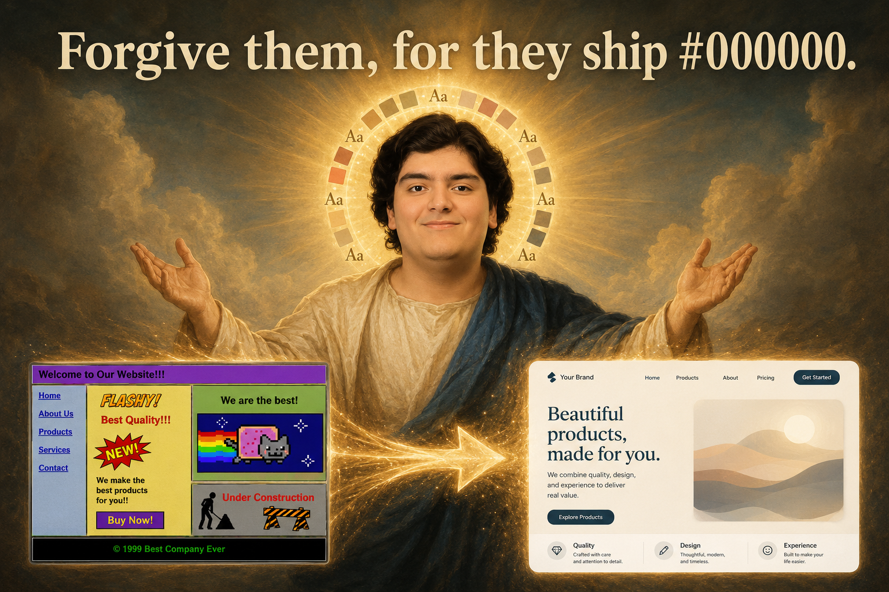
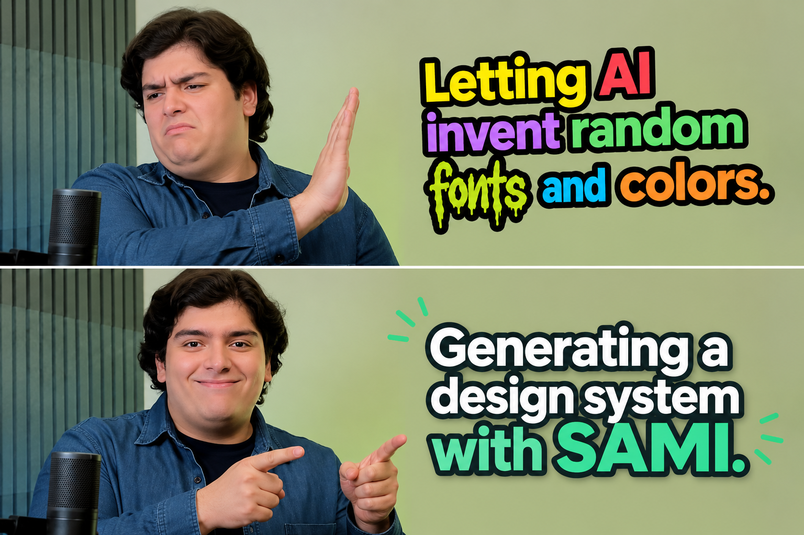

<div align="center">



# SAMI

### Smart Aesthetic Management Interface

**The design engineer that lives in your repo.** Tune one source of truth — colors, type, shape, motion — watch it cascade across real app screens in real time, then export a `DESIGN.md` (and friends) so your AI coding tools build it *consistently* instead of inventing a new font every paragraph.

[**🎨 Open the Studio**](https://smart-aesthetic-management-interface.pages.dev) · [**🤖 Use with AI agents**](#-use-it-with-your-ai-agent) · [**📜 The origin story**](#-the-origin-story)


</div>

---

## 😇 What is this?

You ask an AI to "build me a website." It returns three equal cards in a row, an em-dash in every sentence, `#000000` body text, and an "AI-purple" gradient glow. That, friend, is **slop**.

SAMI exists to stop the slop. It's a visual **design-token studio**: you adjust one cascading source of truth, it propagates to **7 live showcase screens** instantly, and it exports a strict spec your coding agent has to obey. It even runs an automated **Slop Audit** and will, politely but firmly, refuse to let you ship `#000000`.

It is named after a real human (see below) who has Opinions about your kerning.

## ✨ Features

- **The Token Cascade** — change a color, font, radius or motion curve; every screen re-renders instantly.
- **7 live showcase pages** — landing, dashboard, auth, settings, list/detail, pricing, and a full typography specimen, all driven by your tokens (light **and** dark).
- **🤖 AI, the good kind** — *describe* a design in plain English and it builds the tokens; *generate brand-new pages* from a sentence; plus one-click palette sync and name/font suggestions. (Powered by **Cloudflare Workers AI**.)
- **🚔 Slop Audit** — 7 automated taste checks (contrast, saturation, pure-color, single accent, premium fonts) with a one-click, **deterministic** Auto-fix that actually passes.
- **🌍 Farsi + full RTL** — the whole studio and every preview mirror to RTL, with bundled Persian fonts.
- **📦 Export bundle** — `DESIGN.md`, `design-tokens.json`, `theme.css`, an agent prompt, and the audit report.
- **🎛️ Infinite canvas** — pan/zoom a Figma-style board; click a frame to scroll it, scroll empty space to zoom.



## 📜 The origin story

SAMI is named after **Sami** — a dear friend and a genuinely brilliant designer — because that is exactly the job it does: it plays the experienced design engineer on your team. It defines the visual grammar so that everything built afterward stays uniform and beautiful, no matter who (or what) is writing the code.

Any resemblance to a benevolent design deity is purely intentional.



## 🤖 Use it with your AI agent

SAMI exposes a public, CORS-enabled API so Claude Code, Codex, and friends can lock a consistent design system *before* writing a single component.

**Claude Code (one link):**

```
/plugin marketplace add mathofdynamic/SAMI
/plugin install sami-design@sami
```

**Codex / any other agent:** point it at the playbook — `https://smart-aesthetic-management-interface.pages.dev/skill.md` — or this repo's [`AGENTS.md`](AGENTS.md).

**Or just curl it:**

```bash
BASE=https://smart-aesthetic-management-interface.pages.dev/api

# describe a design in english -> a full set of design tokens
curl -s -X POST $BASE/api/ai/describe -H "Content-Type: application/json" \
  -d '{"description":"a calm fintech app, deep green, editorial serif headings"}'

# turn a preset (or your own tokens) straight into theme.css
curl -s -X POST "$BASE/api/generate?format=theme-css" -H "Content-Type: application/json" \
  -d '{"presetId":"forest-premium"}' -o src/theme.css
```

**Endpoints:** `GET /api/presets · /api/schema`, `POST /api/generate` (`?format=design-md|tokens-json|theme-css|agent-prompt|slop-audit`), and the AI set `POST /api/ai/describe|page|audit-fix|suggest`. Full reference in [`SKILL.md`](agent-skill/skills/design-system/SKILL.md).



## 🛠️ Run locally

```bash
npm install
npm run dev      # studio at http://localhost:3000
npm run build    # production build -> dist/
```

The studio is a Vite + React SPA. The `/api` routes are Cloudflare **Pages Functions** in `functions/`, and the AI features run on a **Workers AI** binding declared in `wrangler.toml`. Deploy with `wrangler pages deploy`.

## 🧱 Stack

Vite · React · TypeScript · Tailwind v4 · Cloudflare Pages + Functions · Workers AI · Phosphor icons.

## 🍷 A note on taste

Yes, this README uses emojis. Sami is looking away. The *generated* designs never will.


---

<div align="center">

### [Open the studio →](https://smart-aesthetic-management-interface.pages.dev)

Built with care (and a little chaos). Named after Sami, who would have picked a better font.

</div>
